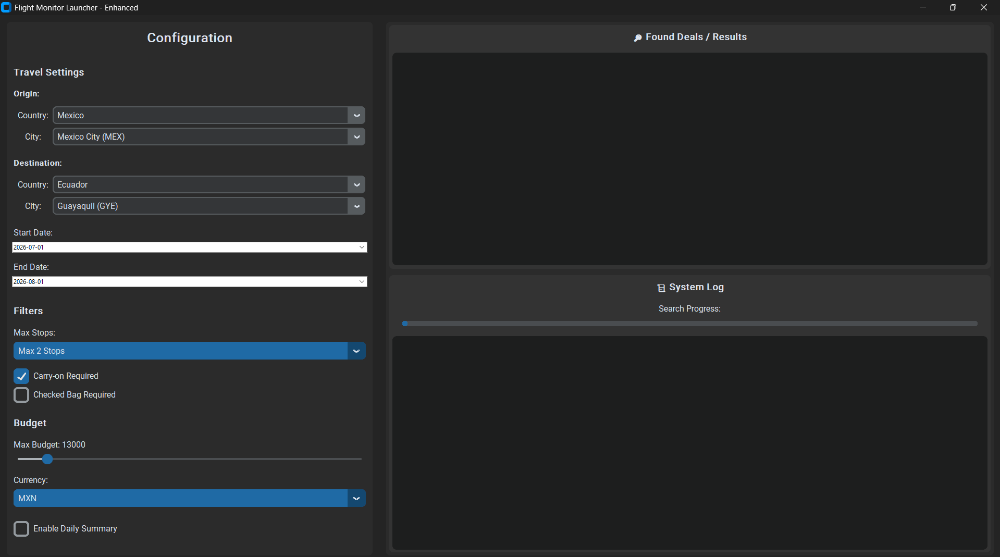

# ✈️ Flight Deal Monitor

> **Smart Flight Price Tracker & Alert System** powered by Amadeus API, Python, and Twilio.

**Flight Monitor** is a production-ready Python application designed to automate the search for flight deals. It continuously scans for flights based on your preferences and uses an intelligent scoring system to detect true bargains, sending instant notifications via WhatsApp.

Ideally suited for digital nomads, frequent travelers, and developers looking for a robust, customizable price tracking solution.

---




## Key Features

- **Automated Scanning**: Automatically searches for flights across extensive date ranges and multiple destination airports.
- **Intelligent Deal Scoring**: Uses a statistical baseline to distinguish "normal" prices from "great deals" (e.g., detects distinct price drops relative to seasonal averages).
- **Hierarchical Destination Selection**:
  - Filter by Country first, then select specific Cities/Airports.
  - Supports major regions (LATAM, USA, Europe, Asia) and custom IATA codes.
- **Direct Booking Links**: Generates deep links to **Google Flights** and **Skyscanner** for immediate booking.
- **Instant Alerts**: Sends WhatsApp notifications via Twilio as soon as a deal is found.
- **Daily Summaries**: If no deals are found, sends a "Best Alternative" summary to keep you informed.
- **Modern GUI**: A clean, dark-mode graphical interface built with `customtkinter` for easy configuration without touching code.
- **Concurrency**: background threads ensure the UI remains responsive during long API search operations.

## Architecture

The project follows a modular architecture designed for maintainability and extensibility:

| Module | Description |
| :--- | :--- |
| **`gui_launcher.py`** | **Frontend**. The entry point for users. Handles configuration validation, hierarchical selection logic, and threads the main execution to keep the UI responsive. |
| **`main.py`** | **Orchestrator**. Manages the entire flow: loading config, initializing clients, running searches, and triggering notifications. |
| **`amadeus_client.py`** | **API Layer**. Handles authentication (OAuth2) and interactions with the Amadeus GDS API. Includes automatic token renewal and rate limiting handling. |
| **`scoring.py`** | **Logic Layer**. Evaluates if a flight is a "deal". Calculates baselines using historical data and applies configurable discount thresholds. |
| **`store.py`** | **Persistence**. Manages a SQLite database (`deals.db`) to store price history/baselines and prevent duplicate notifications for the same deal. |
| **`notifier_whatsapp.py`** | **Notification**. Abstraction layer for Twilio API to send formatted messages with emojis and deep links. |

## Installation

### Prerequisites
- Python 3.8+
- [Amadeus for Developers](https://developers.amadeus.com/) Account (Free Test tier available)
- [Twilio](https://www.twilio.com/) Account (for WhatsApp Sandbox)

### Step-by-Step

1. **Clone the Repository**
   ```bash
   git clone https://github.com/your-username/flight_monitor.git
   cd flight_monitor
   ```

2. **Create a Virtual Environment**
   ```bash
   python -m venv venv
   # Windows
   .\venv\Scripts\activate
   # Linux/Mac
   source venv/bin/activate
   ```

3. **Install Dependencies**
   ```bash
   pip install -r requirements.txt
   ```
   *Key libraries: `requests`, `customtkinter`, `pyyaml`, `python-dotenv`, `tkcalendar`.*

4. **Configure Environment Variables**
   Create a `.env` file in the root directory:
   ```env
   AMADEUS_CLIENT_ID=your_amadeus_api_key
   AMADEUS_CLIENT_SECRET=your_amadeus_api_secret
   TWILIO_ACCOUNT_SID=your_twilio_sid
   TWILIO_AUTH_TOKEN=your_twilio_auth_token
   TWILIO_FROM_NUMBER=whatsapp:+14155238886
   ```

## Configuration

The system is "Configuration-Driven". While `config.yaml` stores all settings, the **GUI** is the recommended way to adjust them.

### `config.yaml` Structure
You can tweak advanced logic here if needed:

```yaml
travel:
  origin_country: "MX"      # ISO Country Code (or IATA City)
  destination_country: "JP" # Target Destination
dates:
  travel_window_start: 30   # Search flights X days from now
  travel_window_end: 150    # Up to Y days from now
filters:
  max_stopovers: 2          # 0=Direct, 1=1 Stop, etc.
budget:
  max_price: 25000          # Absolute max price filter
  currency: "MXN"
system:
  send_summary_if_no_deals: true # Send daily report even if no deals found
```

## Usage

### 1. Run the Launcher
```bash
python gui_launcher.py
```

### 2. Configure & Search
1.  **Select Origin/Destination**: Use the hierarchical dropdowns (e.g., *Japan -> Tokyo*). Use "Custom / Other" to enter manual IATA codes (e.g., `JFK`).
2.  **Set Dates**: Pick your travel window using the calendar.
3.  **Set Budget**: Use the slider to set your maximum spend cap.
4.  **Click "RUN SEARCH"**: The logs will show real-time progress.

### 3. Receive Alerts
You will receive a WhatsApp message like this:

> ✈️ **NUEVA OFERTA DE VUELO** (High Confidence)
>
> 📍 Ruta: **MEX ➡️ NRT**
> 📅 Fecha: **20/05/2026**
> 💰 Precio: **$18,500 MXN**
> 📉 Ahorro: **15% vs Baseline**
> 🔗 **[Ver en Google Flights]**


